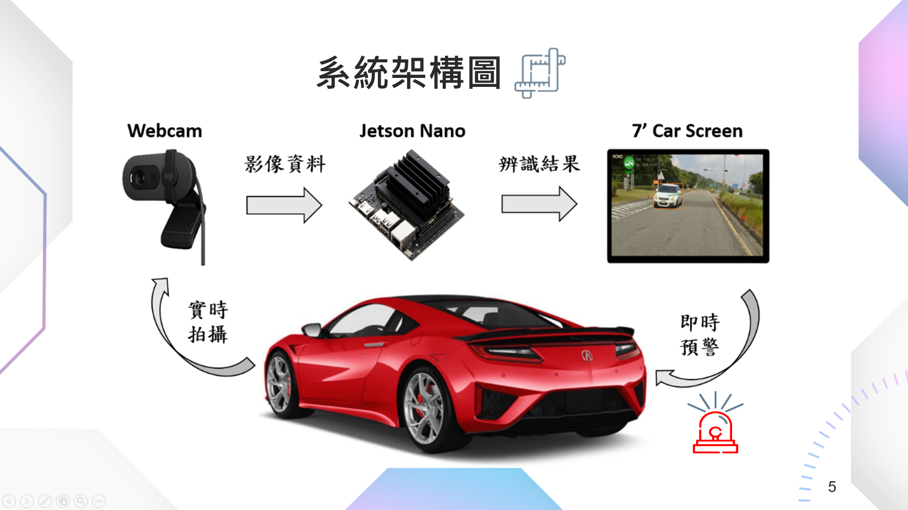

## 基於影像辨識之後車防撞警示邊緣計算輔助系統 Image-Based Rear-End Collision Warning System With Edge Computing Assistance

  

    
本專案在於開發一款可以簡單加裝於現有車輛的後車防追撞預警裝置。這款裝置運用了單目鏡頭來替代昂貴的雷達系統，通過即時影像處理進行後方車輛的偵測與追蹤，減少因後車追撞而導致的傷亡與財產損失。

    
透過Webcam捕捉後方影像，並利用Jetson Nano進行即時邊緣運算。接著，YOLOv5用來進行車輛偵測與辨識，並透過DeepSORT演算法進行車輛的持續追蹤。系統會根據追蹤結果估算相對距離與速度，進而計算碰撞預警時間（TTC）。當TTC小於設定的閾值時，系統會觸發警告訊號，提醒駕駛者即將發生潛在危險；若TTC高於閾值，則顯示安全狀態，確保駕駛者持續注意周邊環境。

  

  

    
  

<iframe width="1024" height="576" src="https://www.youtube.com/embed/Mpxi3kbZOAc" frameborder="0" allow="accelerometer; autoplay; clipboard-write; encrypted-media; gyroscope; picture-in-picture" allowfullscreen></iframe>
