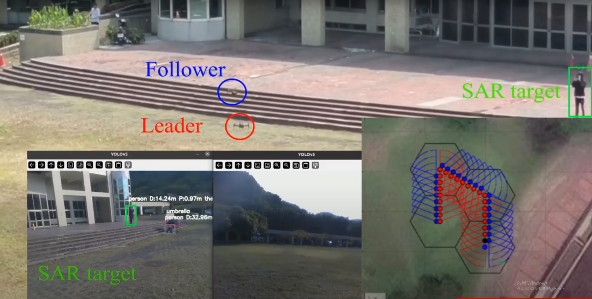

## 多無人機編隊與影像辨識系統 

  

    
本作品旨在研發一套多無人機的編隊搜救系統。結合路徑規劃、影像辨識、無人機編隊控制。系統的主要創新點在於靈活的編隊控制和協同操作，使無人機可根據任務需求動態調整隊形，並通過距離估計與座標轉換計算出精確經緯度，立刻回傳給搜救人員迅速展開行動。

  

  

    
  

<iframe width="1024" height="576" src="https://www.youtube.com/embed/vckYhaKue1g" frameborder="0" allow="accelerometer; autoplay; clipboard-write; encrypted-media; gyroscope; picture-in-picture" allowfullscreen></iframe>

